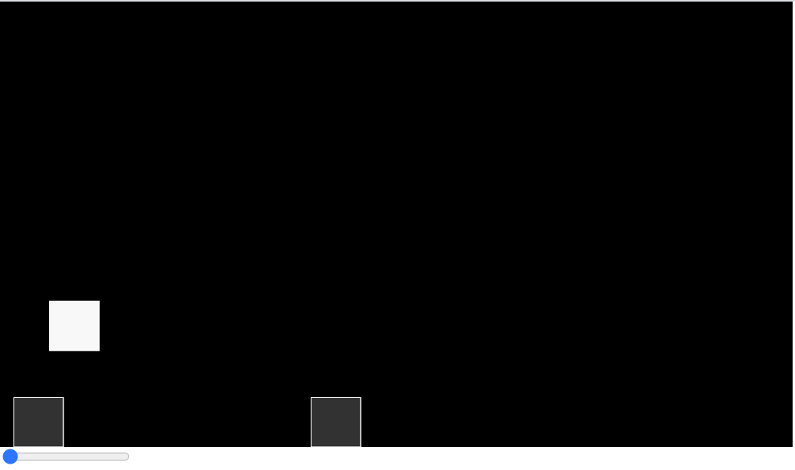

# dinoAI
Neuroevolution Dino Game  

---

## Game  
The tradtional dinosaur game, where you have to jump over the obstacles.

  

The slider present at the bottom can be used to speed up the training.

---

## Usage  
Clone the repository and open index.html in any browser to initialize the training.
Once the performance meets expectation, press 's' to save the weights of the dino to a JSON file.  

---

## Observations
* By the 5th generation the dinosaur had figured out from what distance it has to jump to cross the obstacle.
* By the 11th generation the dinosaur had figured out to jump much earlier to cross multiple obstacle one after the other.

The Weights of the 11th Gen dinosaur has been saved in the ```Dino11thGen.json``` file.

---

## Links and References
* [Neuroevolution Flappy Bird](https://www.youtube.com/playlist?list=PLRqwX-V7Uu6Yd3975YwxrR0x40XGJ_KGO)
* [Genetic Algorithm](https://www.youtube.com/playlist?list=PLRqwX-V7Uu6bJM3VgzjNV5YxVxUwzALHV)
* [Dinosaur Game](https://youtu.be/l0HoJHc-63Q)

